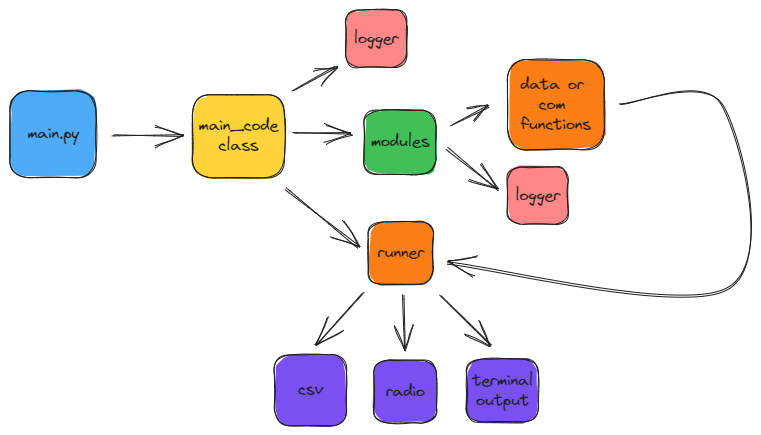

# Python Code Repo

So this is the base python code that runs on our cansat in a small raspberry pi zero 2W microcomputer.

## Code flow

You can see the code flow below:

So the main.py code imports all the modules and then creates a class.

The class has 3 types of functions inside, the **init**() one which is mandatory for initializing and configuring all the modules and sensors that we use, the getXData() ones which just adds the outputs of the different sensor functions in the data arrays, and the last one, the run() one, this function runs the while true loop and calls each data function to retrieve data from the sensors and a) send them via radio b) write them to csv d) print the output in the terminal.

The modules, its modules is its own class with a separate logger for debugging and giving general info about the process of retrieving or sending data from the modules/sensors. The modules are carefully designed so that if a mandatory one fails, like the gps one it will fail the program so we can't launch the cansat.

> The modules won't fail mid flight, the fail procedure happens only in the beginning of the code. If a sensor doesn't respond the program will retry continusly to get data from it and if it fails it will just write None.
